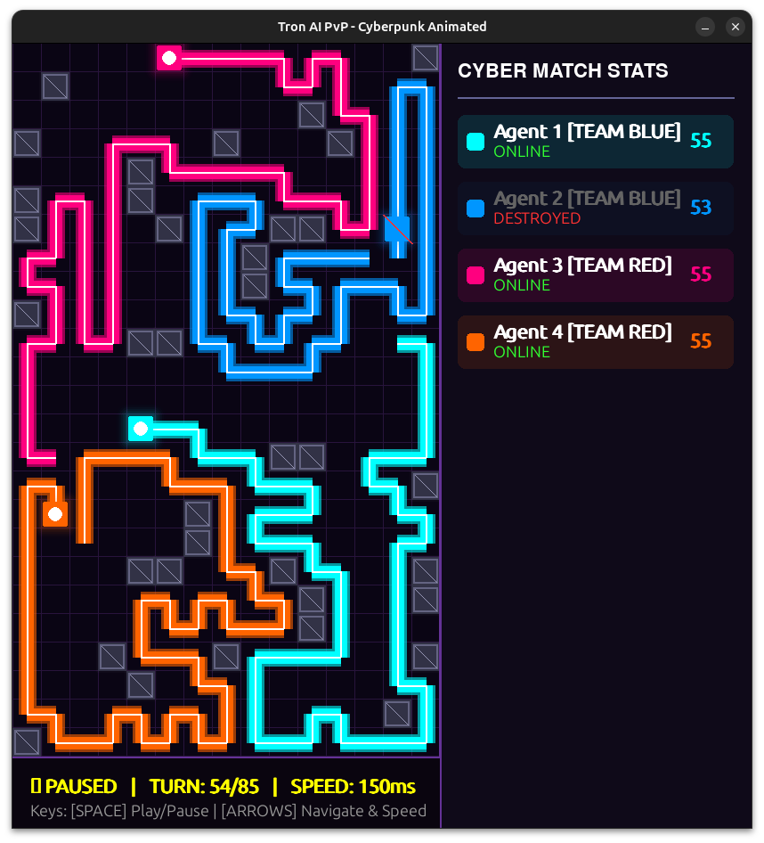

# 🚀 NeonTron AI: PvP Cyberpunk Engine


A high-performance, AI-driven Tron engine featuring multi-agent PvP matches. The core engine is built in **C++** using an optimized **Decoupled UCT (MCTS)** algorithm, while the visuals are rendered in a sleek, Cyberpunk-themed **Python/Pygame** interface.

 *(Add a screenshot of your game here and name it preview.png)*

## ✨ Key Features
- **🧠 Advanced AI Engine:** Powered by a customized Monte Carlo Tree Search (Decoupled UCT) allowing agents to plan deep into the future without state-space explosion.
- **🗺️ Selfish Agent Evaluation:** Uses a Multi-Source Breadth-First Search (BFS) to calculate Voronoi territory control. Each agent acts selfishly to maximize its own survival space.
- **⚔️ PvP Team Matches:** Symmetrical map generation ensuring 100% fair matches between Team Blue and Team Red.
- **🎨 Cyberpunk Visualizer:** Smooth `lerp` animations, neon glow rendering, and dynamic particle explosions using Pygame.
- **🎛️ Match Launcher:** A built-in Tkinter GUI to generate random symmetric maps, select agent counts, and launch the C++ engine pipeline seamlessly.

## 📁 Project Structure

```text
Tron-Cyber-AI/
├── maps/                  # Symmetrical map files (generated by launcher)
├── replays/               # Game history files generated by the C++ engine
├── launcher.py            # Tkinter GUI to generate maps & start matches
├── vis.py                 # Pygame Cyberpunk Visualizer
├── tron / tron.exe        # Pre-compiled C++ Engine (Linux)
├── requirements.txt       # Python dependencies
└── README.md              # Project documentation